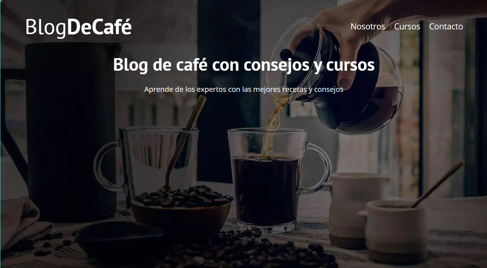
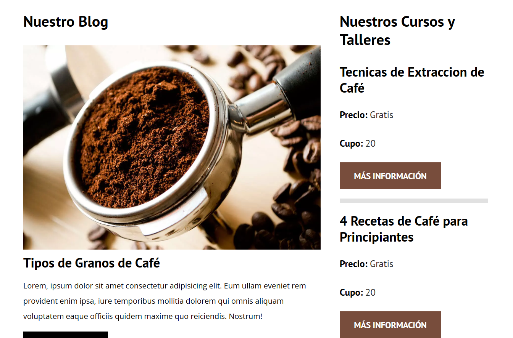
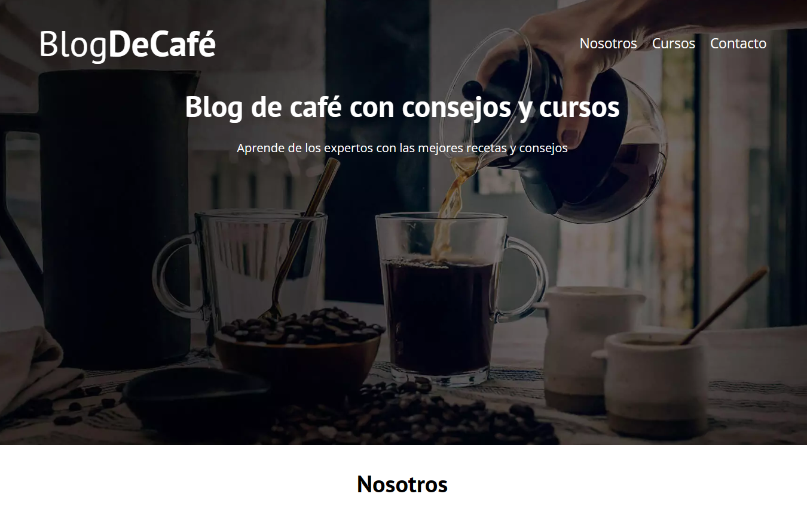

Proyecto de Blog de Cafe realizado con tecnologias como:
    - HTML
    - CSS
    - JavaScript

Lo puedes ver en vivo en: https://raulblogdecafe.netlify.app/

Se creo una portada con una imagen de fondo y una barra de navegacion sobre ella

Tenemos una vista principal con articulos del Blog

En cada una de las páginas del proyecto se mantiene la portada principal
